# House price predictor
_______________________
## Introduction
These notebooks are part of the regression course in ML specialization offered by the University of Washington - Coursera
_______________________
## Simple linear regression (REG01-NB01)
### This is an overview of what the notebook is about.

Regression models describe the relationship between variables by fitting a line to the observed data. in the case of simple linear regression, we only have one input and one output. in this course, we used a case study approach which is predicting house prices.   
our model is just a straight line that is defined by a slope and an intercept.   
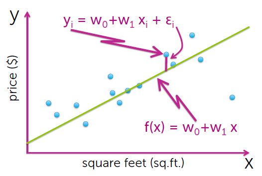  
Now, our task is to try to fit the best possible line for data.   
but how can we define the "best" line?     
First, we need to define a quality metric on which we can measure lines against each other and then choose the best line. this quality metric is the residual sum of squares (RSS). Now our goal is to try to minimize this value for the given coefficients (in our case intercept and slope). the below figure shows what is RSS (depicted as red lines between the data points and the fitted line) and how it's calculated.  

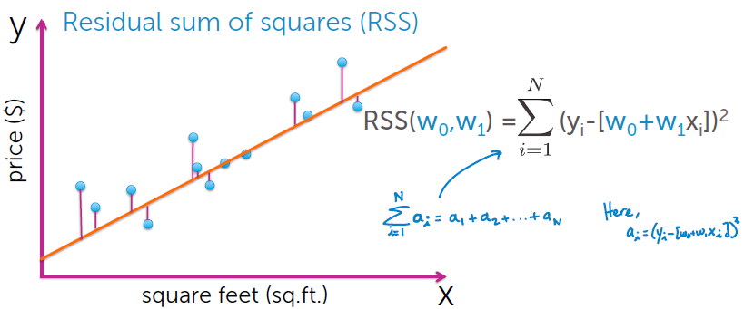  
Now, after we determined the quality metric to choose the best line the next step is "HOW" we are going to find this best line?   
the answer is an algorithm called hill descent in which we compute the gradient of the RSS(the result shown in the figure below), after that, we have two approaches to find the best line:  
1. Analytically (Closed-form Solution).
2. Gradient descent.    

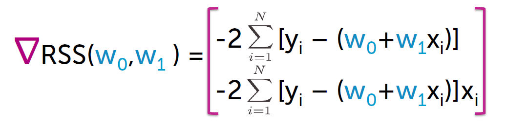  
in this notebook, we will implement method the first method.    
after setting the gradient equal to zero and solving for the slope and intercept we get the following equations:  
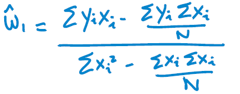 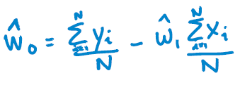 

So, all that is left to do is compute these equations to get the best coefficients that defines the best line which minimizes the cost function. 

________________________________
## Multiple-linear regression (REG02-NB02)
### This is an overview of what the notebook is about.

_____________________________
we discussed in the previous notebook above the simple linear regression, in this notebook we will discuss the multiple-linear regression. in multiple linear regression, we incorporate multiple inputs and a single output. our model will be a polynomial function.   
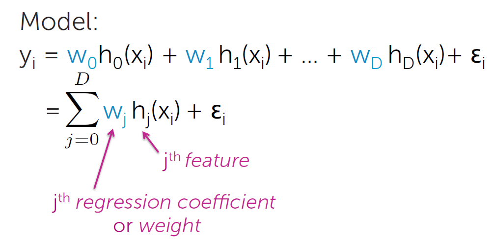  
Now, we will use the same cost function we used in the case of simple regression (RSS). but first, we need to write it in matrix notation   
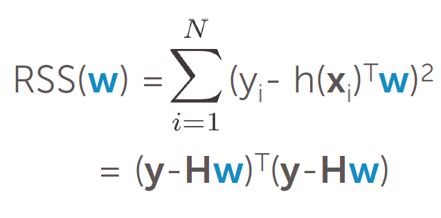       
where **H** is the feature matrix and **W** is the coefficients vector. Just like simple regression we have two approaches:  
1. Analytically (Closed-form Solution).
2. Gradient descent.   

the closed-form solution is not practical and computationally intensive so we will implement the gradient descent. the algorithm is composed of the following steps:  
1. initialize the coefficients to zero or randomly.
2. loop over the features:  
  2.1 compute the patrial derivative.  
  2.2 update the coefficients.

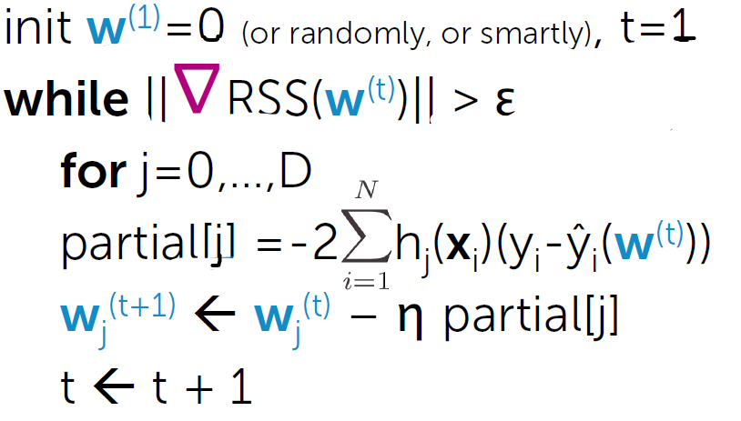

________________________________
## Assessing Fit (REG03-NB01)
### This is an overview of what the notebook is about.  
_____________________________

After we have fitted models in the previous notebooks, now we need to assess how good our model is at fitting our data. the answer is we need to define a loss function such as absolute error, squared error, root mean square error...etc. after defining the appropriate loss function we need to assess the loss.   
**Training error:**  
which is the average loss on the training data. the following figure shows the relation between the training error and the model complexity.   
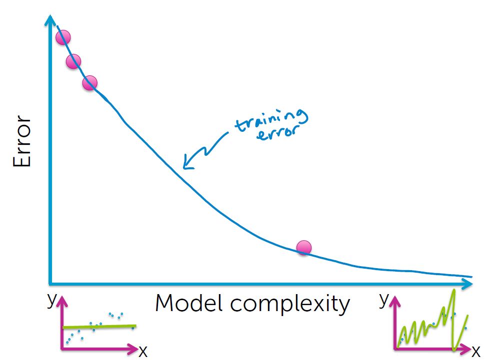    

we can see that as the model complexity increases the training error decreases which makes sense, because when the complexity increases the model tries to fit the data as much as possible and when we go ahead and measure the error (on which the model trying to fit) it make sense that error decreases.  

**Generalization (true) error:**  
it's the average over all possible pairs(x,y) weighted by how likely each is i.e. all the data in the world.  

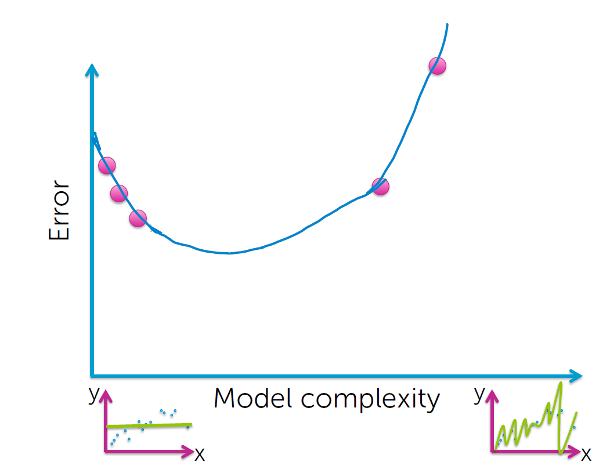   

we can see that as the complexity increases the error drops at first and then goes up. it's not surprising that we can't compute the true error because we can't collect all the data in the world that is related to our problem. what we can do is an approximation of the true error.  

**Test error:**   
it's an approximation of the true error. and computed as the average loss on the test data.    

**Overfitting:**   
overfitting means that your model is doing very well on the data it has seen (training data) but doesn't generalize well on the data it has never seen (test data). we will learn how to deal with overfitting later. the following figure shows the relation between train, test, and true error also formulating the conditions that if it happened we have an overfitting problem.

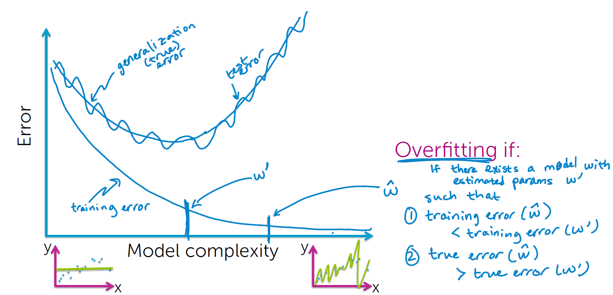

________________________________
## Regularization (REG04-NB01 - REG04-NB02)
### This is an overview of what the notebook is about.  
_____________________________

Now that we know what is overfitting and what conditions need to be fulfilled to say that the model is overfitting. another symptom is that the model coefficients become very large. the issue of overfitting with respect to increasing model complexity is relative to how much data we have.  
- if the # data points are small the model rapidly overfits as the complexity increases.
- if the # data points are large the model is hard to overfit as the complexity increases.

the solution to this problem is using regularization. we will add a term to cost-of-fit to prefer small coefficients. what we want to do is balance between:  
- How will the function fits data
- Magnitude of coefficients   

So, now our total cost becomes the following:   

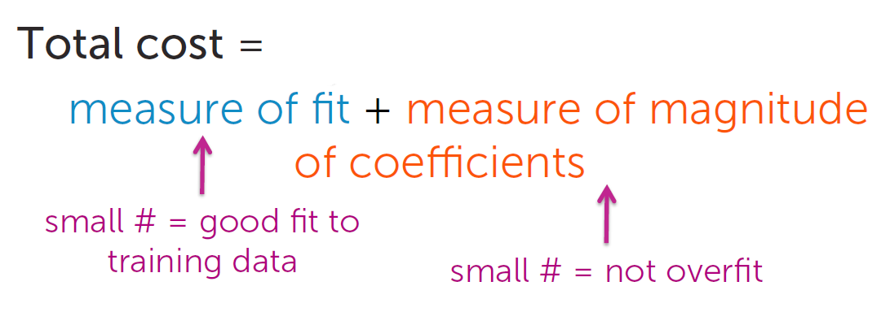   

we already know the measure of fit which is **RSS**, now what is the summary number that is indicative of the size of the coefficients?  
it turns out that it's the sum of squares (L2 norm). so now our total cost becomes the following 

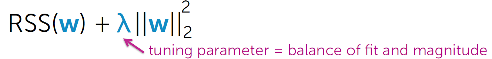 

we use **lambda** to balance between the fit of the model and the size of the magnitude of the coefficients, let us examine the extreme cases of **lambda**:   
- if **lambda** = 0 ----> then we are back with our old solution regression without regularization.
- if **lambda** = infinity ----> the coefficients will reduce to zero which indicates the simplest model there is (no model just noise).   
now we will alter the gradient descent algorithm to account for regression. the new algorithm will be as the following images show.

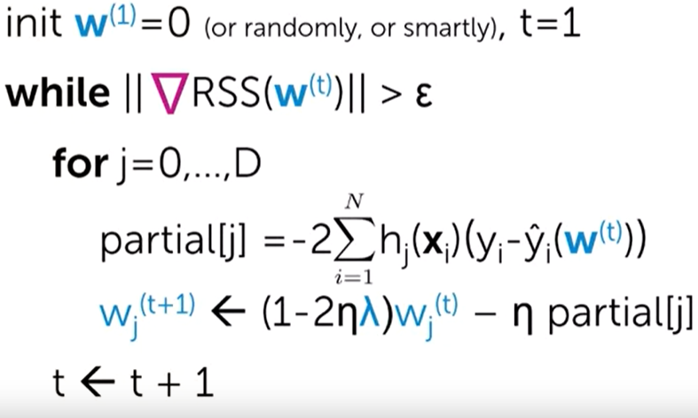    

the difference between this algorithm and the previous version is that we are always shrinking the coefficients before updating the coefficients, which insure that coefficients don't get very large.

